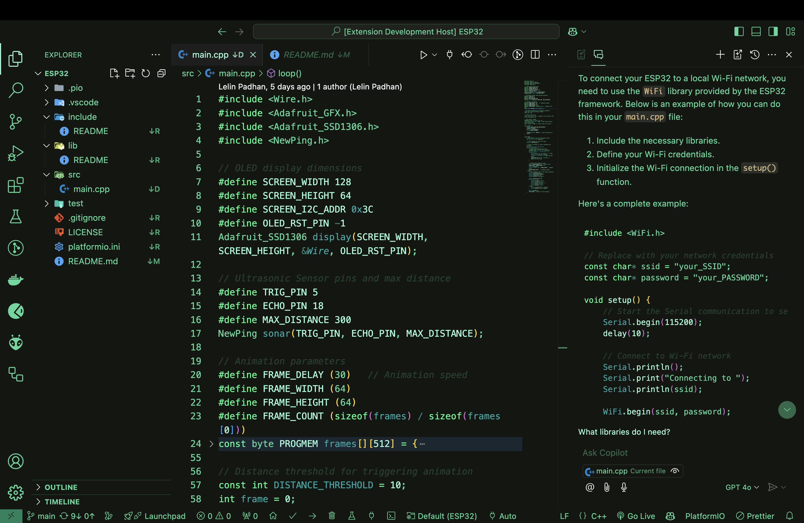
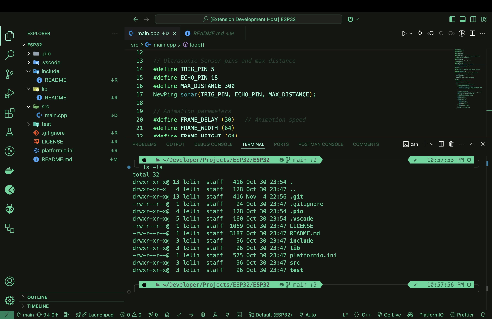

  
  

  
  
  
  
  

[Retro Green Theme](https://marketplace.visualstudio.com/items?itemName=LelinPadhan.retro-green-theme-vscode) is a nostalgic theme inspired by vintage green monitors, bringing a classic look to your Visual Studio Code. Perfect for retro enthusiasts and those who love a vintage aesthetic, this theme offers a classic green-on-black color scheme that is easy on the eyes for long coding sessions. 

## Table of Contents

- [Installation](#installation)
- [Usage](#usage)
- [Feedback](#feedback)
- [Contributing](#contributing)
- [Connect with Me](#connect-with-me)
- [License](#license)

## Installation

1. Open the Extensions view in Visual Studio Code by clicking on the Extensions icon in the Activity Bar on the side of the window or by pressing `Ctrl+Shift+X`.
2. Search for "Retro Green Theme".
3. Click "Install" to install the theme.
4. Once installed, open the Command Palette with `Ctrl+Shift+P` (or `Cmd+Shift+P` on Mac) and select `Preferences: Color Theme`, then choose "Retro Green Theme".

## Usage

1. Press `F5` to open a new window with your extension loaded.
2. Open the color theme picker with the `File > Preferences > Theme > Color Theme` menu item, or use the `Preferences: Color Theme` command (`Ctrl+K Ctrl+T` on Windows/Linux, `Cmd+K Cmd+T` on Mac) and pick your theme.

## Feedback

This is just the beginning! Please give me your feedback so that we can work together to make this theme even more wonderful. Let's be a great community!

## Contributing

If you have any suggestions or find any issues, please feel free to open an issue or submit a pull request. Please read the [CONTRIBUTING.md](CONTRIBUTING.md) for guidelines.

## Connect with Me

  
  
  
  
  

## License

This project is licensed under the MIT License - see the [LICENSE](LICENSE) file for details.

---

Made with ❤️ in India
